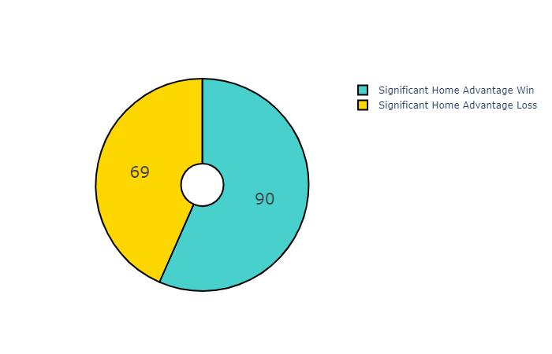

# Bowl Game Home Advantage
Does the location of a bowl game have an impact on the outcome of the game?
\
\
In the lead up to this year's College Football National Championship Game, many people have expressed concern that the location of the game, New Orleans, could lead to an unfair advantage for LSU, as they have far less distance to travel, and are sure to have many more fans at the game than Clemson. In recent years, though, the University of Georgia had the chance to play three SEC Championship and one National Championship in Atlanta, which would presumably give them a sizable home field advantage, however their record in these games is 1-3. \
\
I wanted to obtain a historical basis for whether a university's proximity to a bowl game actually effects the outcome. In order to do this I found a website that listed all of the bowl games that occurred during a specific year (https://www.sports-reference.com/cfb/years/1969-bowls.html). From there it was easy to iterate through all of the years since 1969 and scrape the paricipants, scores, and locations of the bowls.
\
\
Next, I placed a request to the Google Maps Places API for each stadium location and team name, saving the longitude and latitude data of each to a csv. I then used this data and the geopy python module to calculate the straight line distance between the stadium and each of the competing teams. Finally, the distances and scores were compared to determine the percentage of bowl games that have been won by the team that was geographically closer.
\

\

